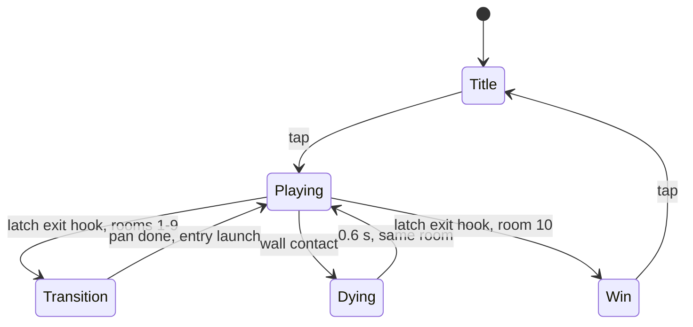

# Flip — Technical Design Document

2026-09-21

## Overview

Flip is a one-button proof of concept for a design test: tap to flip your polarity, swinging between floating hook points to climb through rooms whose walls change charge in a visible wave. The build is 10 hand-made rooms, playable start to finish in a browser on itch.io.

**Core loop:** get launched off the entry hook point, tap to become the opposite color of the next hook point to latch onto it, tap to match its color to push off it, and keep your color matched to the walls so they cushion you instead of pulling you in. Steer around obstacles and latch onto the room's exit hook point to move up to the next room. Touching a wall restarts the current room; touching an obstacle only stops you. The score is the total time to clear all 10 rooms, lower is better.

**In scope**

- One input: tap / click / Space flips player polarity
- Walls whose polarity changes as a continuous wave from top to bottom
- Round hook points, each with a fixed polarity and a small idle bob
- Auto-latch and orbit when attracted, launch when repelled; orbit speed bleeds off over time
- Entry and exit hook points that carry the player from room to room
- A gentle updraft outside hook point fields, so the player never gets stuck
- Square and bar-shaped obstacles that block the way without killing
- 10 hand-made rooms that can't be cleared by drifting on the updraft alone
- Restart at the current room on death; score is total clear time, best time saved locally

**Out of scope for the proof of concept:** procedural generation, endless mode, free movement, a player-controlled room-flip button, menus beyond start and end screens, leaderboards.

**Assumptions**

- Each room is one fixed screen. Latching onto the exit hook point pans the camera up into the next room.
- Portrait layout (9:16 logical resolution), letterboxed on desktop.
- Solo developer, roughly 1–2 weeks of build time.

## Tech stack & project structure

The game uses vanilla JavaScript (ES modules) and the HTML5 Canvas 2D API, with no engine. The visuals are flat shapes and the physics is custom, so an engine adds weight without saving work. Vite handles the dev server and bundling into one static folder for itch.io.

| Layer | Choice | Reason |
| --- | --- | --- |
| Language | JavaScript (ES2020) | Runs everywhere, no compile step |
| Rendering | Canvas 2D | Enough for flat shapes and trails at 60 fps |
| Audio | Web Audio API | Synthesized blips, no audio assets needed |
| Build | Vite | Fast reload, outputs a static bundle |
| Storage | localStorage | Best time only |
| Version control | Git + GitHub | Standard |

```
flip/
  index.html
  src/
    main.js          // boot, resize, start loop
    game.js          // state machine, update/render dispatch
    config.js        // all tuning values (see Tuning parameters)
    input.js         // tap / click / key -> timestamped flip event
    physics.js       // magnetic forces, integration, latch/launch
    wave.js          // wall polarity wave, local polarity lookup
    room.js          // room entity, exit, hook point setup
    rooms.js         // the 10 room definitions (data only)
    entities.js      // Player, HookPoint, Obstacle classes
    collision.js     // circle vs wall, exit detection
    camera.js        // pan between rooms, shake
    render.js        // flat drawing, wave bands, particles
    audio.js         // synth sounds
  tools/
    checkRooms.js    // headless timing check for all 10 rooms (Node)
```

All gameplay numbers live in `config.js` so tuning never touches logic code.

## Game loop & state machine

The loop runs on `requestAnimationFrame` with a fixed physics step of 1/120 s and an accumulator, so orbits and launches behave the same at any frame rate. Rendering happens once per frame and interpolates between physics states.

```
let acc = 0;
function frame(now) {
  acc += Math.min((now - last) / 1000, 0.25); // clamp after tab switch
  last = now;
  while (acc >= STEP) { game.update(STEP); acc -= STEP; }
  game.render(acc / STEP);
  requestAnimationFrame(frame);
}
```



| State | Updates | Input |
| --- | --- | --- |
| Title | Background hook points idle | Tap starts at room 1 |
| Playing | Physics, wall wave, collisions | Tap flips polarity |
| Transition | Camera pan; player held on the exit hook point | Ignored (about 0.4 s) |
| Dying | Slow-mo, particles, death counter +1 | Ignored |
| Win | Total time, deaths | Tap returns to title |

After a death, the room resets: the player is back on the entry hook point, hook points at home, and the wall wave at its starting phase, so every attempt is identical. The wave is paused during Transition so a new room never changes before the player can read it.

**Run timer:** counts real time from the first launch in room 1 until the player latches onto room 10's exit hook point. Deaths, restarts and camera pans all count, and slow-motion effects never slow the timer.

## Core systems

Every magnetic rule reduces to one sign check: polarity is +1 or −1, and the product of two polarities decides attract (−1) or repel (+1). The player is the only fully simulated body; hook points and obstacles are kinematic and never pushed by the player.

### Polarity

- `player.pol` and `hookPoint.pol` are each +1 (blue) or −1 (red). Wall polarity varies with height (see Wall wave). Obstacles have no polarity.
- Hook points never change polarity; each one's color is set in the room data, and a room can mix both colors. Only the player flips. The single exception is the entry hook point (see Entry and exit hook points).
- The rule players learn is about color: be the opposite color of a hook point to latch onto it, the same color to be pushed off it.

### Force model: hook point fields, walls and the updraft

There is no gravity. Where the player is decides which forces apply, and hook point fields always override the walls.

- **Inside a hook point field** (within `fieldRadius`): only hook point forces apply; where fields overlap, the forces of every hook point whose field contains the player add together. No walls, no updraft.
- **Outside every field:** the side walls act horizontally and the updraft lifts vertically.

Outside a field, the player compares its color with the wall color at its own height:

| Player vs. wall at player's height | Result |
| --- | --- |
| Opposite polarity | Pulled toward the nearest wall, faster the closer it gets (danger) |
| Same polarity | Cushioned: movement toward the nearer wall is damped and a gentle push returns the player toward the center, while movement toward the center stays free. The player can never touch a wall in this state |

Hook point force, inside fields (d̂ points from player to hook point):

```latex
\vec{F}_{hook} = -\,k \cdot p_{player} \, p_{hook} \cdot \frac{\hat{d}}{\max(d, d_{min})^{2}}
```

Wall pull, when the player is opposite the walls (x is the distance from the left wall, W the room width):

```latex
F_{pull,x} = -\,k_{w} \cdot \left( \frac{1}{\max(x, d_{min})^{2}} - \frac{1}{\max(W - x, d_{min})^{2}} \right)
```

Wall cushion, when the player matches the walls. It works like a damper rather than a spring, it only resists movement toward the nearer wall, and its push is deliberately much weaker than the pull. With v_w the player's speed toward the nearer wall (zero when moving toward the center):

```latex
a_{x} = -\,c_{w} \, v_{w} \; - \; k_{c} \cdot \frac{x - W/2}{W/2}
```

`wallDamping` (c_w) quickly removes speed toward the nearer wall, and `centerPush` (k_c) drifts the player gently back toward the middle. Because only movement toward a wall is damped, a launch that crosses the room toward the center keeps its sideways speed. As a hard guarantee, a cushioned player's speed toward a wall is set to zero within `safeGap` (12 units) of it, so like two repelling magnets it can never touch. The top and bottom walls exert no force and kill on contact.

### Updraft

Outside every field, a steady updraft keeps the player rising so it can never get stuck. Whenever the player's upward speed is below `riseSpeed` (60 units/s), it is raised toward `riseSpeed` at `updraftGain` per second. Faster upward speed from a launch is kept and decays back toward `riseSpeed` through `drag`.

The updraft is deliberately slow (roughly a quarter of a typical launch speed) and only ever moves the player straight up. Drifting on it alone never finishes a room (see No passive clears).

### Moving between hook points

Hook points never flip, so every hop is about the player's own color:

1. **Latched:** the player is the opposite color of the hook point.
2. **Tap to launch:** the player now matches the hook point and is pushed out of its field.
3. **Read the walls:** outside the field, if the player is opposite the walls at its height, they pull it in, so it taps to match them and get cushioned. If it already matches, no tap is needed.
4. **Catch:** to latch onto the next hook point, the player must be its opposite color when entering its field, which may take one more tap just before arriving.

Because hook points come in both colors and the wave keeps changing the walls, the number and timing of taps per hop varies; that is where the skill is. Being pulled by the walls is also how the player moves sideways: stay pulled to drift toward a side, then tap to be cushioned before reaching it.

A tap made while the player is still inside the launching hook point's field (including the entry hook point's, after an entry launch) is buffered and takes effect the moment the player leaves that field, so an early tap never pulls the player back.

### Entry and exit hook points

Rooms connect through two special hook points instead of gaps in the walls; the top and bottom walls are solid.

- **Exit hook point:** one per room, near the top and always on the opposite side of the room from that room's entry hook point, so a player rising straight up from the entry launch never meets it. Since each exit becomes the next room's entry, rooms alternate sides. It attracts the player whatever the player's color, and latching onto it clears the room.
- **Transition:** the camera pans up over 0.4 s while the player stays held on top of the hook point. The exit hook point becomes the next room's **entry hook point**, at the same x position near the bottom of the new room.
- **Entry launch:** when the pan finishes, the player's color is set to match the walls at the entry height. The entry hook point then flips to that same color, launching the player straight up at `entryLaunchSpeed`. Every room therefore starts with the player cushioned and rising. This is the only hook point that ever flips.
- **Room 1 and restarts:** room 1 starts with the player on an entry hook point at the bottom center. After a death, the player reappears on the entry hook point and is launched again after a 0.5 s ready beat. Taps during the ready beat are ignored.

### Obstacles

Obstacles are square blocks and bars that simply block the way. They have no polarity and no field; magnetic forces pass straight through them.

- **Shapes:** squares and axis-aligned bars only, never circles, so they can't be mistaken for hook points. Static in rooms 2–7. In rooms 8–10 some slide slowly (at most 30 units/s) back and forth along a short fixed track.
- **Contact:** the player is pushed out of the overlap, its velocity into the obstacle is removed, and sliding speed along the edge is cut by `obstacleFriction` (85%). There is no bounce and no death; the player just loses its momentum and has to find a way around.
- **Walls:** a sliding obstacle that pushes the player into a side wall kills, even a cushioned player, because the obstacle overpowers the cushion.
- **Purpose:** obstacles block straight-line launches between hook points, so aim matters, and they sit on the center line to stop players drifting on the updraft.

### Latch and orbit

1. In free flight, if an attracting hook point is within `latchRadius`, the player latches to it.
2. On latch, the starting angular speed ω is the player's arrival speed along the orbit divided by `orbitRadius`, clamped between the room's `minOrbitSpeed` and the global `maxOrbitSpeed`. The orbit direction follows the arrival direction.
3. While latched, ω bleeds off toward `minOrbitSpeed` through `orbitDrag`: ω ← ω_min + (ω − ω_min)·e^(−orbitDrag·dt). Waiting makes a launch easier to time but costs time on the clock.
4. Walls and other hook points are ignored while latched. Each step: θ += ω·dt, and the player sits at `hookPoint.pos + orbitRadius·(cos θ, sin θ)`, so the orbit follows the hook point's bob.
5. A faint tether line is drawn between player and hook point.

### Launch

A launch happens when the player taps and becomes the same color as the latched hook point, or when the entry hook point flips at the start of a room.

- Launch velocity = tangential velocity (ω·r, along the orbit) + radial push of `launchImpulse` away from the hook point, capped at `maxSpeed`.
- The released hook point gets a `relatchCooldown` so the player cannot instantly re-latch to it.
- Aiming is purely about timing: where the player is on the orbit when it taps decides the launch direction.

### Wall wave

Wall polarity changes as a continuous wave, not a sudden flip. A horizontal front travels from the top of the room to the bottom over `wavePeriod` seconds. Walls above the front show the new polarity, walls below still show the old one. When the front leaves the bottom, the next front starts at the top with the opposite polarity, so the walls always show exactly two bands.

For a point at distance s below the top of a room of height H, with starting polarity p₀:

```latex
n(s,t) = \left\lfloor \frac{t}{T} - \frac{s}{H} \right\rfloor + 1, \qquad p(s,t) = p_{0} \cdot (-1)^{\,n(s,t)}
```

Here T is `wavePeriod`. The wave only changes the walls; hook points keep their color.

- **Readable timing:** the player sees the front approaching its own height and can tap before the walls turn against it.
- **Every room has a wave:** room 1 introduces it together with hook points, using the slowest period, so a player who never taps is always eventually pulled into a wall.
- **Walls turning:** outside a field, the front passing the player's height flips the walls relative to the player. A cushioned player suddenly gets pulled toward a wall and must tap (see Human timing, rule 4).

## Human timing

Every timing requirement assumes a human, not a frame-perfect input. The budget from seeing a cue to the tap registering is set at 350 ms: roughly 250 ms visual reaction plus 50–100 ms of touch and display latency (approximate figures; confirm in playtesting). Every rule below is built around that budget.

### Rules

1. **Minimum launch window.** For every hop a room requires, the range of orbit angles that produces a successful launch must last at least `minLaunchWindow`: 300 ms in rooms 1–3, 220 ms in rooms 4–7, 160 ms in rooms 8–10. It is measured at the room's `minOrbitSpeed`, because a player can always wait for the orbit to slow down. A launch that hits an obstacle counts as a failure.
2. **Orbit speed cap.** `maxOrbitSpeed` (6 rad/s) limits how fast a fast arrival can orbit, and `orbitDrag` bleeds that speed off within a couple of seconds.
3. **Minimum catch window.** After a player leaves a hook point field while being pulled toward a wall, the time until wall contact must be at least `minCatchWindow`: 600 ms in rooms 1–3, 480 ms in rooms 4–7, 400 ms in rooms 8–10. The wall pull `k_w` and hook point placement are tuned so this holds at every point where a room's intended route leaves a field, including fields near the walls. `checkRooms.js` measures each one.
4. **Wave grace in free flight.** When the front passes the player's height outside any field, wall force for that player stays off for `waveGrace` (400 ms), then ramps to full over 150 ms. That is longer than the 350 ms reaction budget, so even a player cushioned right next to a wall has time to tap.
5. **Minimum wave period.** `wavePeriod` never drops below 4 s, so the walls at any height change at most every 4 s.
6. **Latency compensation.** Taps are timestamped with `event.timeStamp`. The launch uses the orbit angle from `inputLatencyComp` (60 ms) before the tap was processed. Tune it in playtesting; 0 disables it.
7. **Launch assist.** The launch direction is nudged by up to `launchAssist` (6°) toward the nearest hook point field (never the one being left) or the exit hook point. 0 disables it.
8. **Field edge spacing.** Hook point fields never touch a side wall: at least `wallMargin` of open space separates any field edge from a wall.
9. **Obstacle clearance.** Obstacles never cross an orbit (orbitRadius + player radius + 10 units), every obstacle leaves a gap of at least 3 player diameters on one side, and sliding tracks stay at least 3 player diameters from side walls.

### Automated timing check

`tools/checkRooms.js` runs every room headlessly. For each required hop, it orbits at the room's `minOrbitSpeed`, tries launching at every 5 ms step around the orbit, records which launches succeed, and measures the longest continuous success window. A room fails if any hop's window is below that room's `minLaunchWindow`, or if any catch window from rule 3 is too short. All 10 rooms must pass before a build goes to itch.io.

## Entities & data structures

There are four entity types: Player, HookPoint, Obstacle and Room. All positions are in logical units on a 360 × 640 room, scaled to the canvas at render time.

```
class Player {
  pos = {x, y};  vel = {x, y};
  radius = 8;
  pol = +1;               // +1 blue, -1 red
  latched = null;         // HookPoint or null
  theta = 0; omega = 0;   // orbit state while latched; omega bleeds off
  bufferedTap = false;    // tap made inside the launching field
  graceTimer = 0;         // free-flight wave grace countdown
  alive = true;
}

class HookPoint {
  kind;                   // 'normal' | 'entry' | 'exit'
  home = {x, y};          // fixed anchor point
  pos = {x, y};           // home + bob offset, recomputed each step
  radius = 14;            // always a circle
  fieldRadius = 70;       // 50 for entry/exit hook points
  pol;                    // fixed from room data; exit attracts any color
  bob = { ampX, ampY, freq, phase };  // idle motion
  cooldown = 0;           // seconds before re-latch allowed
}

class Obstacle {
  shape;                  // 'square' | 'bar' (never round)
  pos = {x, y};           // center
  w; h;                   // size
  track = null;           // { dx, dy, period } for sliding obstacles
}

class Room {
  index;                  // 1-10
  originY;                // world Y of this room's bottom edge
  wave = { enabled, period, startPol, time };
  minOrbitSpeed;          // orbit speed floor for this room
  minLaunchWindow; minCatchWindow;
  entry;                  // HookPoint, x = previous room's exit x
  exit;                   // HookPoint near the top, off the center line
  hookPoints = [];
  obstacles = [];
}

// rooms.js: plain data, one object per room
{ index: 4, wave: { enabled: true, period: 7, startPol: +1 },
  minOrbitSpeed: 3.0, minLaunchWindow: 0.22, minCatchWindow: 0.48,
  entry: { x: 265, y: 590 },   // matches room 3's exit x
  exit:  { x: 95,  y: 80 },
  hookPoints: [ { x: 180, y: 470, pol: -1, ampX: 6, ampY: 4, freq: 0.4 },
                { x: 110, y: 320, pol: +1, ampX: 6, ampY: 4, freq: 0.4 },
                { x: 250, y: 200, pol: -1, ampX: 6, ampY: 4, freq: 0.4 } ],
  obstacles:  [ { shape: 'bar', x: 180, y: 250, w: 80, h: 14 } ] }
```

**Bob motion:** `pos = home + (ampX·sin(2π·freq·t + phase), ampY·sin(4π·freq·t + phase))`. The doubled Y frequency traces a small figure-eight: readable, predictable, never still.

**World layout:** rooms stack vertically. Room n's exit hook point sits near its top; room n+1's entry hook point is that same hook point, at the same x, near the bottom of room n+1. The game keeps only the current and next room in memory.

## Rooms & difficulty

The proof of concept has 10 hand-made rooms, stored as data in `rooms.js`. Each room introduces or combines one idea, and difficulty rises through tuning, never through new rules.

### Room layouts

| Layout | Arrangement | What it tests |
| --- | --- | --- |
| Ladder | Hook points zigzagging upward | Basic launch and catch rhythm |
| Leap | 2 hook points with a wide vertical gap | Precise launch timing |
| Sidestep | Hook points near alternating side walls | Launching away from walls |
| Cluster | 4–5 hook points packed in the middle | Choosing which hook point to catch |

### Room plan

| Room | Layout | Teaches | Hook points | Obstacles | Wave period | Min orbit speed | Bob amplitude | Min launch window |
| --- | --- | --- | --- | --- | --- | --- | --- | --- |
| 1 | Single | Wave walls and hook points | 1 | 0 | 9.0 s | 2.8 rad/s | 0 | 300 ms |
| 2 | Ladder | Obstacles | 2 | 1 | 8.5 s | 2.8 rad/s | 4 | 300 ms |
| 3 | Ladder | Hook points of both colors | 2 | 1 | 8.0 s | 2.8 rad/s | 4 | 300 ms |
| 4 | Ladder | Longer climb, aiming around obstacles | 3 | 1 | 7.0 s | 3.0 rad/s | 6 | 220 ms |
| 5 | Sidestep | Launching away from walls | 3 | 1 | 6.5 s | 3.2 rad/s | 8 | 220 ms |
| 6 | Leap | One long launch past obstacles | 2 | 2 | 6.0 s | 3.2 rad/s | 8 | 220 ms |
| 7 | Cluster | Picking the right hook point | 5 | 2 | 5.5 s | 3.4 rad/s | 10 | 220 ms |
| 8 | Sidestep | First sliding obstacle, bigger bob | 4 | 3 | 5.0 s | 3.6 rad/s | 14 | 160 ms |
| 9 | Leap + Ladder | Long launch into a climb | 4 | 3 | 4.5 s | 3.8 rad/s | 14 | 160 ms |
| 10 | Mixed finale | Everything combined | 5 | 4 | 4.0 s | 4.0 rad/s | 16 | 160 ms |

Hook point counts exclude the entry and exit hook points. Wave periods never drop below 4 s (Human timing, rule 5). Bob amplitude is in logical units. Exit hook points sit at x 80–110 or 250–280, so their fields stay clear of the center line and the side walls, and always on the opposite side from the room's entry hook point.

### Building a room

1. Sketch the intended route: which hook points the player uses, in what order, their colors, where the wave turns the walls, and which launches the obstacles block.
2. Place hook points and obstacles in `rooms.js`, following Human timing rules 8–9, keeping hops shorter than `maxReach`, and placing the exit hook point in its allowed x range.
3. Run `tools/checkRooms.js`. Adjust spacing, colors, orbit speed, bob or obstacle positions until every hop meets the room's windows and both passive bots fail (see below).
4. Playtest by hand. A room is done when a first-time player clears it within 5 attempts (rooms 1–5) or 10 attempts (rooms 6–10).

### No passive clears

A player must never clear a room by riding the updraft while doing nothing else. Every room has a wave, so a player who never taps is eventually pulled into a wall. The real risk is a player who only taps when the wave turns the walls: it stays cushioned and rises almost straight up from where it was launched, drifting slowly toward the **center line** (the vertical middle of the room). Every rule below keeps that path away from the exit.

1. **Exit opposite the entry.** The exit hook point is always on the opposite side of the room from the entry hook point, so the straight climb from the entry launch never reaches it.
2. **Exit off the center line.** The exit hook point's field stays at least `centerLineClearance` (20 units) clear of the center line, so a player that drifts to the middle rises past it into the top wall.
3. **Hook points on the center line.** At least one hook point field covers the center line, so a drifting player is either caught (and must launch to move on) or pushed off course.
4. **Obstacles on the center line.** From room 2, at least one obstacle sits on the center line in the upper half of the room, stopping drifting players who slip past a hook point.
5. **Reaching the exit takes skill.** The exit hook point is reached by launching toward it, or by letting the walls pull the player sideways and tapping to be cushioned in time. Both need well-timed taps.

### Passive bots

`tools/checkRooms.js` also runs two bots in every room, and a room fails if either one reaches the exit:

- **Idle bot:** never taps after the entry launch.
- **Drift bot:** never launches from a hook point, but always taps to stay cushioned when outside a field, riding the updraft for as long as it survives.

## Collision, input, camera & room transitions

### Collision

Three checks matter: player versus walls, player versus obstacles, and latching onto the exit hook point. Hook points have no solid collision; touching one while attracted means latching, and repelled players can't reach one. Obstacle contact stops the player but never kills on its own (see Obstacles).

- **Walls:** the room is an axis-aligned rectangle with no gaps. Touching any wall kills. A player can only reach a side wall while being pulled by it, or when a sliding obstacle pushes it there.
- **Room links:** rooms connect only through the exit and entry hook points (see Entry and exit hook points).
- **Tunneling:** at `maxSpeed` a player moves about 4 units per 1/120 s step, well under its 8-unit radius, so simple overlap tests are safe.

### Input

- Pointer down (mouse or touch) or Space flips polarity. One flip per press; holding does nothing.
- Inputs are queued and consumed at the next physics step so timing stays frame-rate independent.
- `touch-action: none` on the canvas stops mobile scroll and zoom. The first tap also unlocks Web Audio.

### Camera & transitions

- During play the camera frames the current room exactly; nothing scrolls.
- On latching the exit hook point, the camera eases up by one room height over 0.4 s (ease-out cubic) while the player stays held on the hook point. The entry launch then starts the new room's wave.
- The previous room is discarded once the pan finishes, and the room after next is loaded from `rooms.js` in the background.
- Screen shake: 3 units for 0.1 s on each entry launch, 10 units for 0.3 s on death.

## Rendering, feedback & audio

The visual language is flat pastel shapes on a light background: solid fills and solid strokes only, with no gradients, glows, blur or shadows. Blue means positive and red means negative everywhere. Every polarity-colored shape also carries a + or − mark in a dark ink color, so the game stays readable for color-blind players and pastel colors never rely on contrast alone.

### Palette

| Role | Color | Hex |
| --- | --- | --- |
| Positive (+) | Pastel blue | #9CC7F2 |
| Negative (−) | Pastel red | #F4A3A3 |
| Background | Warm off-white | #F7F3EC |
| Ink (outlines, marks, text) | Soft charcoal | #3B3A45 |
| Neutral (obstacles, UI panels) | Pastel grey | #D9D6E0 |

- **Walls:** thick solid bands in the local wall polarity color. The wave front is a hard edge between a blue band and a red band, never a blend.
- **Hook points:** always circles, in their polarity color with a 2-unit ink outline and a + or − mark.
- **Entry and exit hook points:** larger circles with a double ink ring. The exit hook point is drawn half blue and half red, since it attracts either color, and its outer ring slowly rotates so it reads as the way out.
- **Obstacles:** square blocks and bars in pastel grey with an ink outline and no mark, never round, so they can't be confused with hook points. A sliding obstacle's track is a faint dotted ink line.
- **Player:** a smaller solid circle in its polarity color with an ink outline and mark. The motion trail is a few fading solid dots (opacity steps, not a gradient).
- **Updraft:** a few faint ink dashes drifting slowly upward in the open space, so players can see the air is moving.

**Logo:** the word "Flip" with the capital F upside down, in ink on the off-white background. The title screen flips the F right side up and back on each tap, matching the core mechanic.

### Readability aids

- **Wave front line:** a thin ink line across the full room at the front's height, so the player can see when it will reach its own height.
- **Field rings:** a solid ink ring at `fieldRadius` around each hook point marks its field. The ring is thin at low opacity normally and thicker while the player is inside it, so players always know whether the walls can reach them.
- **Tether:** a thin ink line from player to hook point while latched.
- **Launch preview (rooms 1–2 only):** a dotted line from the player showing where a tap right now would send it.

### Feedback

| Event | Visual | Audio (Web Audio synth) |
| --- | --- | --- |
| Player flip | Instant color swap, one ring pop | Short blip, pitch by polarity |
| Latch | Hook point scales up 10% for one beat | Soft click |
| Launch | A few solid dots puff opposite the direction of travel | Short whoosh (filtered noise) |
| Entry launch | Entry hook point swaps color, small shake | Low thump |
| Obstacle hit | Obstacle flashes its ink outline | Dull tap |
| Near miss (within 6 units of a wall while pulled) | 80 ms slow-mo | Rising chime |
| Room cleared | Room number pops | Ascending two-note chime |
| Death | Player breaks into solid dots, shake, slow-mo | Descending buzz |

The canvas renders at device pixel ratio (capped at 2) for crisp edges on phones.

## Tuning parameters

These are starting values for `config.js`, meant to be changed during playtesting. Distances are in logical units (room is 360 × 640), times in seconds.

| Parameter | Start value | Controls |
| --- | --- | --- |
| k (hook point force) | 2 000 000 | How hard hook points pull and push inside their field |
| k_w (wall pull) | 400 000 | How hard walls pull a player of the opposite color |
| wallDamping (c_w) | 6 per second | How fast the cushion removes speed toward the nearer wall |
| centerPush (k_c) | 80 units/s² | Gentle push back to the center while cushioned |
| safeGap | 12 | Closest a cushioned player can get to a side wall |
| d_min | 24 | Force cap at close range |
| fieldRadius | 70 | Size of a normal hook point's field |
| exitFieldRadius | 50 | Size of entry and exit hook point fields |
| latchRadius | 30 | Distance at which the player latches |
| orbitRadius | 30 | Orbit size while latched |
| minOrbitSpeed | 2.8 → 4.0 rad/s | Orbit speed floor (per room) |
| maxOrbitSpeed | 6.0 rad/s | Orbit speed cap on arrival |
| orbitDrag | 0.8 per second | How fast orbit speed bleeds toward the floor |
| launchImpulse | 180 units/s | Extra radial push on launch |
| entryLaunchSpeed | 240 units/s | Upward launch from the entry hook point |
| relatchCooldown | 0.25 | Time before re-latching the same hook point |
| riseSpeed | 60 units/s | Updraft speed outside fields |
| updraftGain | 3 per second | How fast the updraft restores rising speed |
| drag | 0.25 per second | Decays launch speed back toward riseSpeed |
| maxSpeed | 480 units/s | Overall speed cap |
| obstacleFriction | 0.85 | Share of sliding speed lost on obstacle contact |
| centerLineClearance | 20 | Minimum gap between the exit field and the center line |
| maxReach | 220 | Hook point spacing limit when building rooms |
| wallMargin | 30 | Minimum gap between a field edge and a side wall |
| wavePeriod | 9.0 → 4.0 | Time for the wave front to cross the room (per room) |
| waveGrace | 0.40 | Wall force delay after the front passes the player |
| minLaunchWindow | 0.30 → 0.16 | Shortest allowed launch window (per room) |
| minCatchWindow | 0.60 → 0.40 | Shortest time from field exit to wall contact (per room) |
| inputLatencyComp | 0.06 | Orbit-angle rewind to offset touch latency |
| launchAssist | 6° | Maximum launch-direction nudge |
| player radius | 8 | Hitbox size |
| hook point radius | 14 | Visual size |

The most sensitive values are `k_w`, `fieldRadius`, `minOrbitSpeed` and `launchImpulse`. Together they decide whether launching feels snappy or floaty and how much time the catch tap gets, so tune them first in Room 1 before building the other rooms. Rerun `tools/checkRooms.js` whenever any of them change, because they shift every launch and catch window.

## Performance, build & deployment

The game targets a steady 60 fps on a mid-range phone browser and a download under 200 KB. Scale is tiny (1 player, at most 12 hook points across two rooms), so the budget is spent on draw calls, not physics.

### Performance rules

- Physics is O(hook points) per step; no spatial partitioning needed.
- Particles come from a fixed pool of 200, never allocated during play.
- Flat fills and strokes only (no gradients, blur or shadows), which also keeps mobile draw cost low.
- No per-frame object allocation in the update loop (reuse vector objects) to avoid garbage-collection stutter.
- Pause the loop on `visibilitychange` so switching tabs doesn't cause a physics jump.

### Build

- `npm run build` (Vite) outputs `dist/` with `index.html` at the root and relative asset paths (`base: './'`).
- No external requests, fonts or CDNs; everything ships in the bundle.

### itch.io setup

1. Zip the contents of `dist/` (not the folder itself) so `index.html` is at the zip root.
2. Create a project with Kind of project set to HTML, upload the zip, and tick "This file will be played in the browser".
3. Viewport: 360 × 640 embed, with "Mobile friendly" enabled and fullscreen button on.
4. Test in the itch.io preview on desktop Chrome, desktop Firefox, iOS Safari and Android Chrome before publishing.
5. Keep the page restricted or draft until submission if the company wants a private link.

## Milestones, risks & open questions

The plan front-loads the feel of latch and launch, because if that isn't fun by day 3, nothing built on top will fix it.

### Milestones

| Day | Milestone | Done when |
| --- | --- | --- |
| 1 | Loop, input, Room 1 shell, wall pull and cushion, updraft | Tap flips color; a cushioned player can't touch a wall, a pulled one can |
| 2–3 | Hook point fields, latch, orbit with speed bleed, launch, latency compensation | Launch-and-catch around Room 1 feels good |
| 4 | Wall wave, front line, free-flight grace, obstacles | The wave turns walls against the player fairly; obstacles block without killing |
| 5 | Entry and exit hook points, camera pan, restart, win screen, run timer | Rooms 1–3 playable back to back |
| 6 | `tools/checkRooms.js` (timing checks + passive bots) and rooms 4–10 | All 10 rooms pass; neither passive bot clears any room |
| 7 | Flat pastel art pass, feedback, audio | Matches the palette; responsive with sound on and off |
| 8 | itch.io build, device test, 3–5 player playtest | Most testers reach room 10 within 15 minutes |

### Risks

| Risk | Impact | Mitigation |
| --- | --- | --- |
| Launch feels floaty or random | Core loop fails | Tune in Room 1 first; keep launch preview in early rooms |
| Timing too tight for humans | Testers quit | 350 ms human budget, launch windows measured at the slowest orbit, orbit speed cap, automated timing check |
| Walls turning feels unfair | Players blame the game | Visible front line, free-flight wave grace, catch window (Human timing, rule 3) |
| Hops needing extra taps feel confusing | Players miss catches | Teach the color rule in room 3; field rings show when walls stop mattering |
| Pastel colors hard to tell apart | Misread polarity | + and − marks in ink on every polarity shape; test with a color-blind simulator |
| Mobile touch latency | Timing feels off | `pointerdown` events, latency compensation, test on a real phone by day 5 |

### Open questions

No open questions right now.
