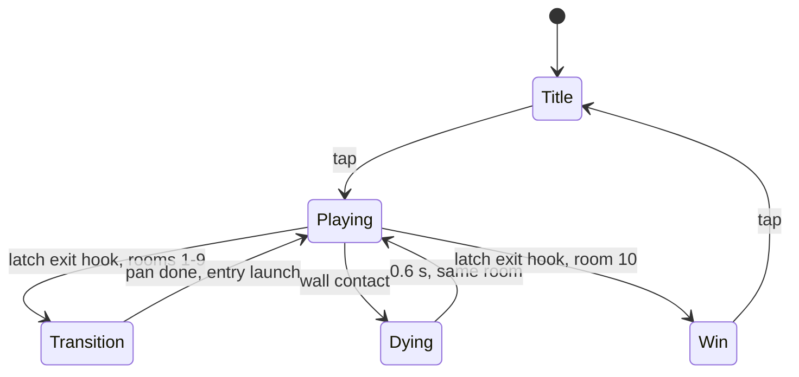

# Game Loop & State Machine

Owned by `src/main.js` (loop) and `src/game.js` (states). Source: [Flip TDD](../sources/flip-tdd.md).

## The loop

`requestAnimationFrame` with a **fixed physics step of 1/120 s** and an accumulator, so orbits and launches behave the same at any frame rate. Rendering happens **once per frame** and **interpolates** between physics states.

```js
let acc = 0;
function frame(now) {
  acc += Math.min((now - last) / 1000, 0.25); // clamp after tab switch
  last = now;
  while (acc >= STEP) { game.update(STEP); acc -= STEP; }
  game.render(acc / STEP);
  requestAnimationFrame(frame);
}
```

Two details that matter:

- **The 0.25 s clamp** prevents a spiral of death after a tab switch.
- **`game.render(acc / STEP)`** receives the interpolation alpha, not a delta.

Also pause the loop on **`visibilitychange`** so switching tabs doesn't cause a physics jump — see [Build & deployment](build-and-deployment.md).

## States



| State | Updates | Input |
|---|---|---|
| **Title** | Background hook points idle | Tap starts at room 1 |
| **Playing** | Physics, wall wave, collisions | Tap flips polarity |
| **Transition** | Camera pan; player held on the exit hook point | **Ignored** (about 0.4 s) |
| **Dying** | Slow-mo, particles, death counter +1 | **Ignored** |
| **Win** | Total time, deaths | Tap returns to title |

## Reset semantics

After a death, the room resets so **every attempt is identical**:

- Player back on the entry hook point
- Hook points at home
- Wall wave at its **starting phase**
- **0.5 s ready beat** before the entry launch; taps during it are ignored

**The wave is paused during Transition** so a new room never changes before the player can read it. See [Room transitions](../concepts/room-transitions.md).

## Run timer

- Counts **real time** from the **first launch in room 1** until the player **latches onto room 10's exit hook point**.
- **Deaths, restarts and camera pans all count.**
- **Slow-motion effects never slow the timer.**

Score is total clear time — **lower is better**. Best time saved to `localStorage`.

**Design tension this creates:** orbit speed bleeds toward `minOrbitSpeed` through `orbitDrag`, so waiting on a hook point makes a launch easier to time **but costs time on the clock**. See [Latch, orbit & launch](../concepts/latch-orbit-launch.md).

## Slow-motion events

Slow-mo is visual only and never affects the timer:

| Trigger | Duration |
|---|---|
| Near miss (within 6 units of a wall while pulled) | 80 ms |
| Death | part of the 0.6 s Dying state |

See [Rendering, feedback & audio](rendering-feedback-audio.md).

## Related pages

- [Project structure](../entities/project-structure.md) — `main.js` / `game.js` contracts
- [Room transitions](../concepts/room-transitions.md) — the Transition state in detail
- [Collision & input](../concepts/collision-and-input.md) — which states consume input
- [Polarity & force model](../concepts/polarity-force-model.md) — what runs inside `game.update`
- [Wall wave](../concepts/wall-wave.md) — pause and reset behaviour

---

## Decision Log

### [22-09-26] — Page created
- **Added:** Loop code verbatim, state diagram, state table, reset semantics, run timer rules, slow-motion table.
- **Notes:** Loop snippet and mermaid diagram quoted exactly. The "design tension" note links the timer to orbit drag — both are source facts, the connection is stated in the source's orbit section and repeated here for implementation context.
